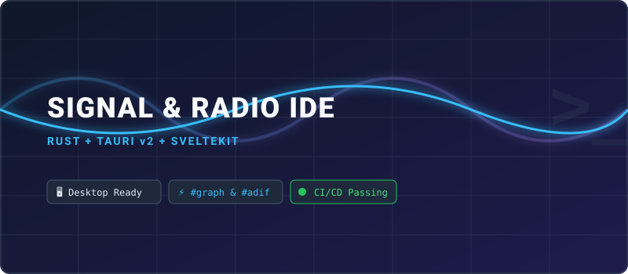

# Signal & Radio Log

  

  
  
  
  
  

<strong>Weniger tippen. Mehr Zeit auf Sendung.</strong>

## Ein Funklogbuch, das beim Funken nicht im Weg steht

**Signal & Radio Log** ist ein leichtes Offline-Logbuch für Funkamateure. Rufzeichen eingeben, Band und Betriebsart antippen, RST prüfen und das QSO speichern. Ein Konto ist nicht nötig, und die Einträge bleiben auf dem eigenen Gerät.

Einen besonderen Platz haben **QRPp**-Experimente mit 500, 100 oder sogar 50 mW. Verbindungen mit jeder anderen Leistung werden ebenfalls gespeichert: QRPp ist eine Einladung zum Experimentieren, keine Einschränkung.

### Was bereits möglich ist

- QSO-Eingabe mit großen, daumenfreundlichen Schaltflächen;
- Hoch- und Querformat auf Mobilgeräten sowie Layouts für Tablet und Desktop;
- Verbindungen suchen, bearbeiten und löschen;
- ADIF 3.1.7 importieren und exportieren, ohne unbekannte Felder zu verlieren;
- Markdown-Notizen mit Live-Vorschau schreiben;
- Tabellen und Mermaid-Diagramme mit fertigen Vorlagen kennenlernen;
- mit einmaligem Antippen zwischen Englisch, Ukrainisch und Deutsch wechseln.

## Download

Die aktuelle Version steht unter **[Releases](https://github.com/juv4uk/my-ide/releases)** bereit. Builds sind für Windows, Linux, macOS, Android, iOS Simulator, Raspberry Pi / ARM64 und das Web vorgesehen.

## Wie es weitergeht

**QSO Connect** soll eine Brücke zwischen dem Funkkontakt und privater Online-Kommunikation bilden. Die verschlüsselte Protokollbasis wird bereits vorbereitet. Zuerst ist ein Internet-Relay geplant; später können WebRTC P2P und möglicherweise LoRa folgen. Das Logbuch selbst bleibt vollständig offline nutzbar.

## Über den Autor

Ich bin **Waldemar**, Funkamateur und Entwickler von Signal & Radio Log. Ich baue ein Werkzeug, das ich selbst verwenden möchte: einfach für Einsteiger, praktisch im Feldeinsatz, respektvoll gegenüber persönlichen Daten und offen für Experimente.

GitHub: **[@juv4uk](https://github.com/juv4uk)**

## Entwicklung und Lizenz

Das Projekt basiert auf Tauri 2, SvelteKit, TypeScript und Rust. Beiträge, Übersetzungen, Gerätetests und praktische Amateurfunk-Erfahrung sind willkommen.

Signal & Radio Log ist unter der **[MIT-Lizenz](LICENSE)** verfügbar.
