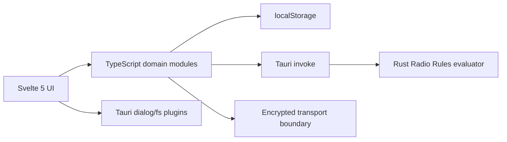

# Architecture · Архітектура · Architektur

**[English](#english) · [Українська](#українська) · [Deutsch](#deutsch)** · [Documentation home](README.md)

## English

### Runtime layers

- **SvelteKit + Svelte 5:** single-page UI in `src/routes/+page.svelte`.
- **TypeScript domain layer:** QSO model, repository, ADIF, i18n, Notes integration, Radio Rules bridge, and QSO Connect protocol under `src/lib`.
- **Tauri v2:** desktop/mobile shell, file/save dialogs, filesystem write, and Rust commands.
- **Rust:** capability-free Radio Rules parser/evaluator in `src-tauri/src/radio_rules.rs`.

### Main modules

| Path | Responsibility |
|---|---|
| `src/routes/+page.svelte` | Four tabs, responsive UI, Notes templates/rendering, import/export orchestration |
| `src/lib/qso.ts` | QSO/Profile types, UTC helpers, RST defaults, IDs, normalization |
| `src/lib/qso-store.ts` | `localStorage` repository and profile migration |
| `src/lib/adif.ts` | ADI 3.1.7 parsing/export and unknown-field preservation |
| `src/lib/i18n.ts` | English/Ukrainian/German message catalog |
| `src/lib/radio-rules.ts` | QSO-to-rule context and Tauri invocation |
| `src/lib/connect/protocol.ts` | Invites, key derivation, encrypted envelopes |
| `src/lib/connect/relay-transport.ts` | Vendor-neutral WebSocket relay adapter |
| `src/lib/ft8/codec.ts` | FT8 decode/encode wrapper around ft8js's Emscripten modules |
| `src/lib/ft8/wasm-assets.ts` | Generated base64 payload of the two ft8js `.wasm` binaries |
| `src/lib/ft8/Ft8Panel.svelte` | FT8 tab: mic capture, resampling, decode loop, message list |
| `src-tauri/src/lib.rs` | Tauri plugins and allowed command registration |
| `scripts/make-portable-web.mjs` | Embeds Web icons into a standalone HTML artifact |
| `scripts/generate-ft8-wasm-assets.mjs` | Regenerates `wasm-assets.ts` from `node_modules/ft8js/wasm/*.wasm` |

### Data flows

**Save QSO:** UI normalizes callsign → repository upserts by local ID → JSON array is written to `localStorage` → sorted list is reloaded.

**Import:** browser reads text → length-aware ADIF parser creates new local IDs → repository merges by ID → UI reloads. Unknown fields go into `extraFields`.

**Export:** records become ADIF 3.1.7 → Tauri save dialog/filesystem or browser Blob download.

**Notes:** textarea updates local storage → 220 ms debounce → lazy imports of Marked/Mermaid → sanitization → `{@html}` preview.

**Radio Rules foundation:** UI/domain code converts watts to milliwatts → Tauri command receives a fixed snapshot → Rust parses and validates → only suggestions return.

**QSO Connect foundation:** human code derives public room ID and AES key → transport sees room ID and encrypted envelope, never plaintext.

**FT8 decode:** `getUserMedia` mic stream → rolling buffer reaches a 15 s window → `OfflineAudioContext` resamples to 12,000 Hz mono → `decodeFt8()` calls the ft8js Emscripten module → messages render newest first. The Emscripten loader normally `fetch()`es its `.wasm` binary relative to its own file, which neither the single-file portable Web build nor Tauri's asset origins can satisfy; `wasm-assets.ts` embeds both binaries as base64 so `codec.ts` can hand them to the module via `wasmBinary` instead, with no network request and no companion file, identical across every build target.

### Web and Tauri builds

Normal Tauri builds use split frontend chunks and pathname routing. `BUILD_TARGET=web` switches SvelteKit to inline bundling, relative paths, and hash routing. The portable builder embeds remaining PNG/SVG references into one HTML file. The application is client-side; no Node server is required at runtime.

### Responsive design

The shell supports a 320 px minimum viewport, safe-area insets, sticky header, bottom navigation, touch targets of about 44 px or more, a 900 px content limit, and special landscape rules for short screens. Desktop uses the same components rather than a separate UI.

## Українська

### Шари

- **SvelteKit/Svelte 5** — односторінковий адаптивний інтерфейс у `+page.svelte`.
- **TypeScript-модулі** — модель QSO, сховище, ADIF, переклади, нотатки, QSO Connect і міст до Radio Rules.
- **Tauri v2** — оболонка платформ, системні діалоги, запис файлів і виклик Rust.
- **Rust** — ізольований парсер та обчислювач Radio Rules без доступу до системи.

Основні потоки: QSO нормалізується й записується JSON у `localStorage`; ADIF розбирається за заявленою довжиною полів; нотатки після затримки 220 мс проходять Marked/Mermaid та очищення; Web-збірка вбудовує всі ресурси в один HTML.

**FT8:** мікрофон (`getUserMedia`) → буфер накопичує 15-секундне вікно → `OfflineAudioContext` ресемплить до 12000 Гц моно → `decodeFt8()` викликає Emscripten-модуль ft8js → повідомлення показуються найновіші згори. Стандартний завантажувач Emscripten робить `fetch()` за `.wasm`-файлом відносно себе — це не сумісно ні з портативною Web-збіркою, ні з origin-ами Tauri. `wasm-assets.ts` вбудовує обидва бінарники як base64, тож `codec.ts` передає їх модулю через `wasmBinary` — без мережевого запиту й без супутнього файлу, однаково на всіх платформах збірки.

Звичайні Tauri-збірки використовують розділені chunks і pathname router. `BUILD_TARGET=web` вмикає inline bundle, відносні шляхи й hash router для `file://`. Окремого Node-сервера під час роботи немає.

Адаптивність забезпечують safe-area, липкий заголовок, нижня навігація, touch-цілі близько 44 px, мінімальна ширина 320 px і правила для низьких альбомних екранів.

## Deutsch

### Schichten

- **SvelteKit/Svelte 5:** responsive Single-Page-Oberfläche.
- **TypeScript-Domäne:** QSO, Speicher, ADIF, Übersetzungen, Notizen, Connect und Rules-Brücke.
- **Tauri v2:** Plattformhülle, Dialoge, Dateischreiben und Rust-Aufrufe.
- **Rust:** isolierter Radio-Rules-Parser ohne Systemfähigkeiten.

QSOs werden normalisiert als JSON in `localStorage` gespeichert. ADIF wird längenbasiert verarbeitet. Notizen durchlaufen nach 220 ms Marked/Mermaid und Sanitizing. Für `BUILD_TARGET=web` werden Inline-Bundle, relative Pfade und Hash-Routing aktiviert; anschließend werden Symbole in eine einzige HTML-Datei eingebettet. Zur Laufzeit ist kein Node-Server nötig.

**FT8:** Mikrofonstream (`getUserMedia`) → ein rollender Puffer erreicht ein 15-s-Fenster → `OfflineAudioContext` resampelt auf 12.000 Hz mono → `decodeFt8()` ruft das Emscripten-Modul von ft8js auf → Nachrichten erscheinen neueste zuerst. Der Standard-Loader von Emscripten lädt seine `.wasm`-Datei per `fetch()` relativ zu sich selbst — das erfüllen weder der portable Single-File-Web-Build noch Tauris Asset-Origins. `wasm-assets.ts` bettet beide Binärdateien als Base64 ein, sodass `codec.ts` sie dem Modul über `wasmBinary` übergibt — ganz ohne Netzwerkaufruf und ohne Begleitdatei, identisch auf allen Build-Zielen.

Safe-Area-Abstände, Sticky Header, untere Navigation, etwa 44 px große Touch-Ziele, 320 px Mindestbreite und Querformatregeln bilden dieselbe Oberfläche auf Mobilgerät und Desktop ab.

